# DC-Portfolio
Portfolio for defensive cybersecurity unit

## A1
   In the security concepts used on campus includes authorisation, authentication, firewall protection.
This can be proved by doing the things against the permitted action.
Such as for proving authentication I have shared the image which shows that when trying to gain access of the studentconnect 
I am getting asked for my login credentials

This image is for proving authentication being asked

  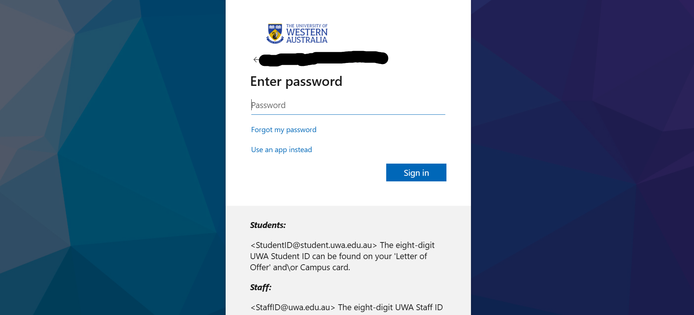

WHen I entered the system in LMS after entering my credentials it diverted me to the students section which appears as in the image which is different from the staff view point.

This image is for the given authorization

  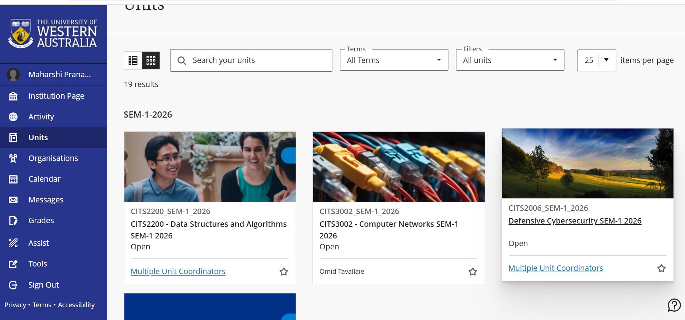

For better understanding the work of firewall I visited the website which contains comic manghas using university's wi-fi
and it showed me the outcome showed in the image below.

This image is for proving the firewall protection

  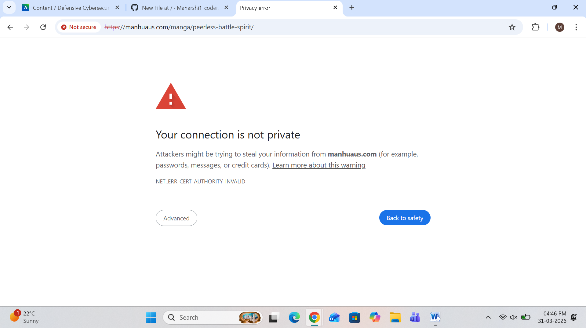

## A2
  In public spaces the following picture shows how good it is to have security guards at public place as it maintains the security

  

Surveillance cameras are implanted at public places for the safety and monitoring activities is showed by the photo below

  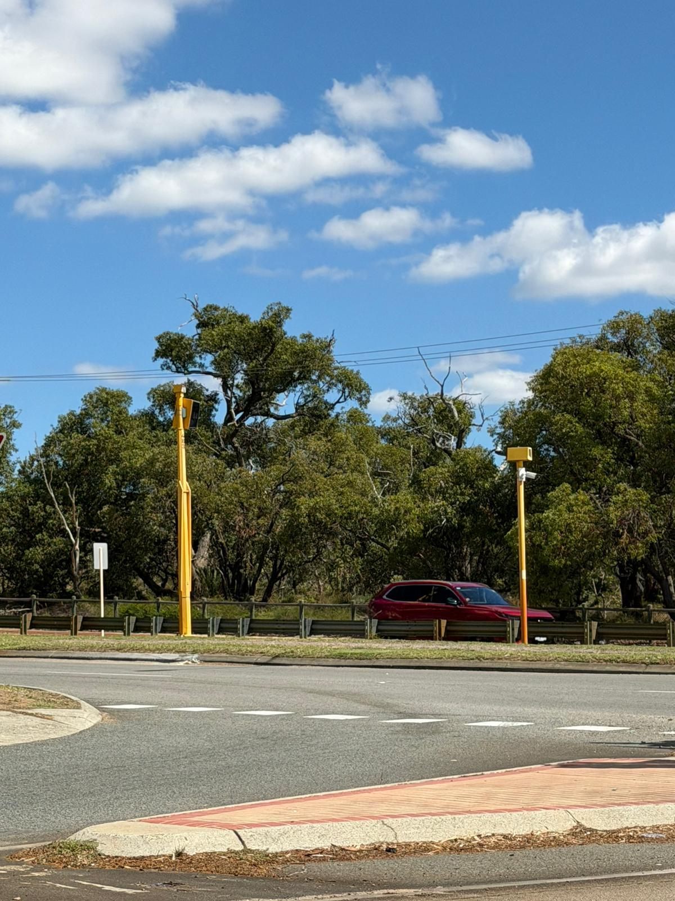

Alarms such as fire or any emergency at public place is shown in the picture below

  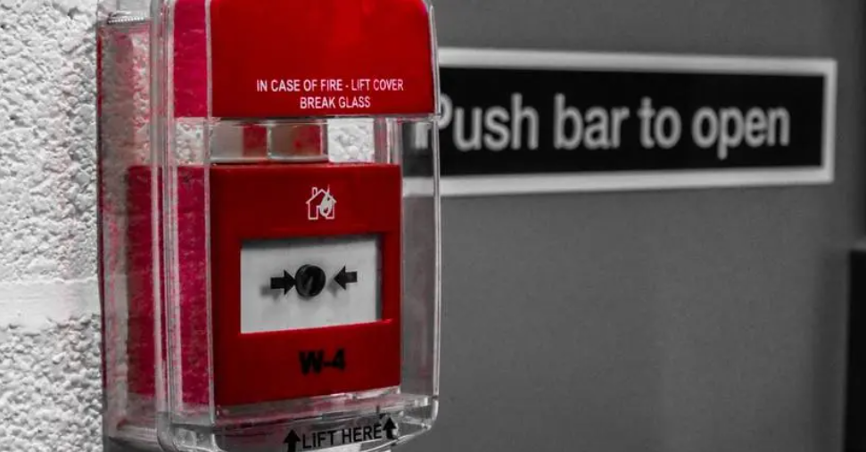

## A3
   The photos of the security concepts used in my house is in the photos below

This image is for Alarms at home
   

  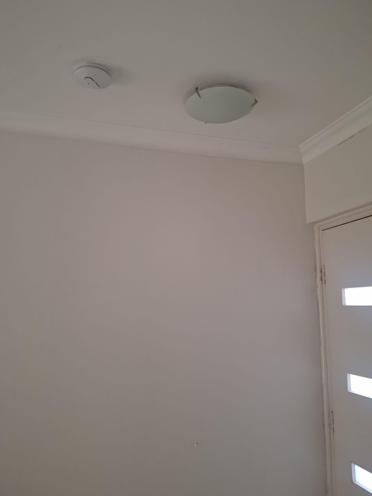

This image is for showing doorlock protection

  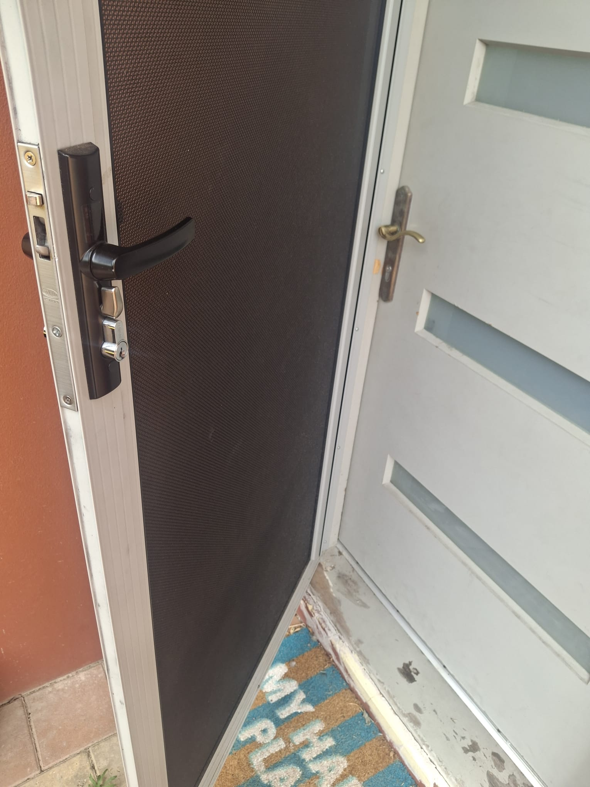

This image is for showing wi-fi protection

  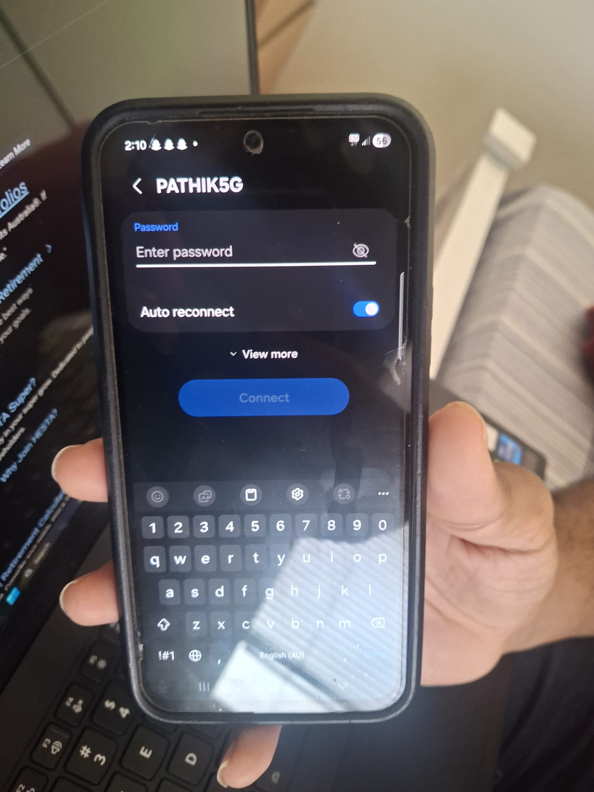

## A5
   As per the statement from the journal published by IETF on August 2018, TLS is now successfully being implemented for online cryptography and encryption.
   Below is the link for that journal.
   https://datatracker.ietf.org/doc/html/rfc8446?

   And as per the FIPS AES is now used for protecting data against malicious attacks and for security. Below is the link for that
   https://www.scribd.com/document/487707139/NIST-FIPS-197-pdf?

   And the link below proves RSA being used for online implementation in cryptography.
   chrome-extension://efaidnbmnnnibpcajpcglclefindmkaj/https://people.csail.mit.edu/rivest/Rsapaper.pdf?

 ## A6
    The standards published by NIST shows that how disk encryption is used for protecting data using different algorithms.
    chrome-extension://efaidnbmnnnibpcajpcglclefindmkaj/https://nvlpubs.nist.gov/nistpubs/Legacy/SP/nistspecialpublication800-111.pdf

    Another published of NIST shows that how protection using password and hashing is important to kepp data safe and how it is used.
    https://pages.nist.gov/800-63-3/sp800-63b.html

 ## A7
      The handbook of applied cryptography of university of waterloo is a wonderful and excellent book showcasing and explaining how the cryptography is used in modern network which includes the use of symmetric and asymmetric encryption, TLS, key exchange functions, etc.. The link of the book is below.
      https://cacr.uwaterloo.ca/hac/

## A8
   To prove that AES and hashing algorithms are being used in IoT devices as cryptography, below is the link to the pdf of the academic journal published on April 2024.
   chrome-extension://efaidnbmnnnibpcajpcglclefindmkaj/https://www.mecs-press.org/ijcnis/ijcnis-v16-n2/IJCNIS-V16-N2-4.pdf?

   Also, to add on the back support the below link shows an academic survey on lightweighted cryptography used on IoT devices using key exchange and AES.
   chrome-extension://efaidnbmnnnibpcajpcglclefindmkaj/https://pdfs.semanticscholar.org/cfe4/966fd2982a43c7ad0a77d5a393787f1a8b92.pdf?

## A9
   To show how Tor browsing or anonymous browsing helps keep privacy safe, I am providing the research paper which shows how safe browsing using different tools and hiding technology like icognito mode helps keep our privacy
   chrome-extension://efaidnbmnnnibpcajpcglclefindmkaj/https://www.heinz.cmu.edu/~acquisti/papers/Acquisti_Increasing_Adoption_Tor_Browser_Using_Info_Planning_Nudges.pdf?

   Thesis by Alla Sedneva shows how ToR and VPN are used for keeping the online privacy [This the thesis pdf](VPNandTor(A9).pdf)

## A10
   To show how for offline privacy protection on screen the below picture is very useful as it shows half of the screen covered with the privacy frame and other half without it.
   

  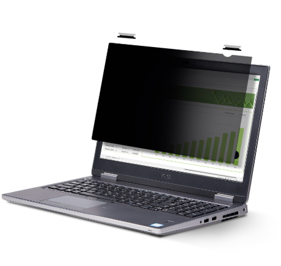

To show how anonymization is I have grabbed a random medical journal from onesearch, in there it shows the data of people by saying 14-36 months and not the accurate figure.This is called anynomization
A Randomized Trial of the Accuracy of Novel Telehealth Instruments for the Assessment of Autism in Toddlers. (2024). Journal of Autism and Developmental Disorders, 54(6), 2069-2080. https://doi.org/10.1007/s10803-023-05908-9

Access control is like a lock which we can open in its respective way. The picture below shows one of such access control device.

  

## A11
   To show five unique access control devices, below are there pictures.
   **1**
   

  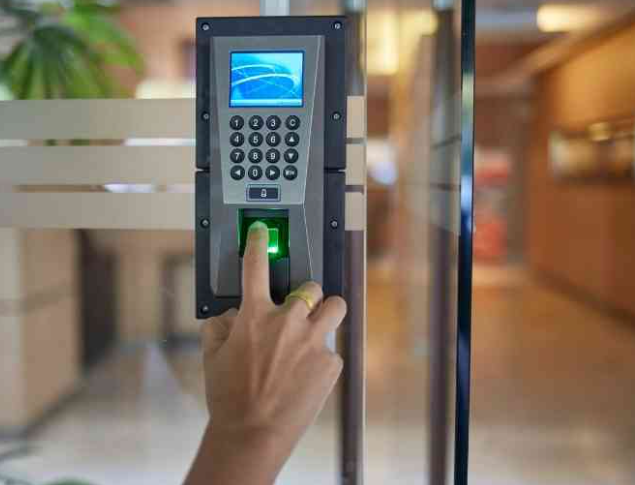

   **2**

  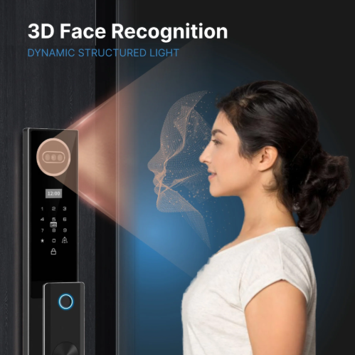

   **3**

  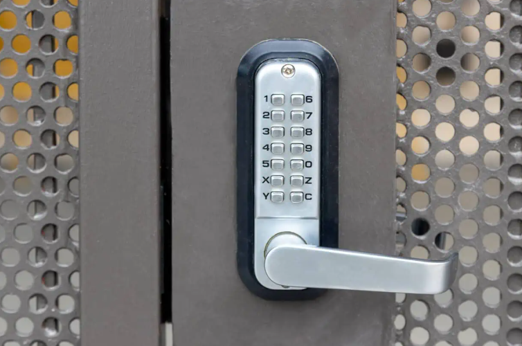

   **4**

  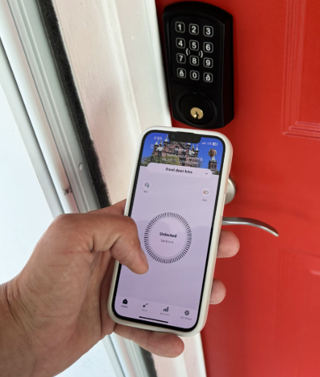

   **5**

  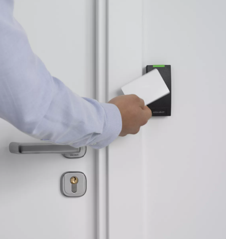

